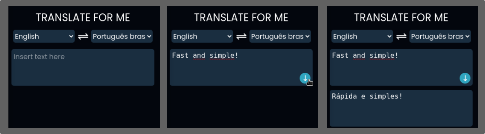

# Translate for Me



## About this project

**Translate for Me** is a minimalist web extension text translator with more than 90 diferent languages. The extension use the [My memory api](https://mymemory.translated.net/doc/).

The key idea is to be **practical, simple and objective.**

- suport for more than 90 languages

- pop up translator

- 5000 free characters per day

## Why?

This project was been created with the objective of increase my experience level on programming. I wanted to create something that could be useful or help people in some way, so this project came up.
Feel free to use this in the way you wish, as well as to provide me any feedback about it.

connect with me on [LinkedIn](https://www.linkedin.com/in/lucas-zacarias-/)

## Future ideas

- lang swap

- firefox extension release

- history of uses

- theme dark and light

## How to use

### Adding from the github

> 1. Clone the repository
>    
>    ```
>    $ git clone https://github.com/L-Zack/TranslateForMe 
>    ```
> 
> 2. Open [Chrome extensions tab](chrome://extensions/)
> 
> 3. Click on *Load unpacked*
> 
> 4. Search the Translate for Me folder among your files
